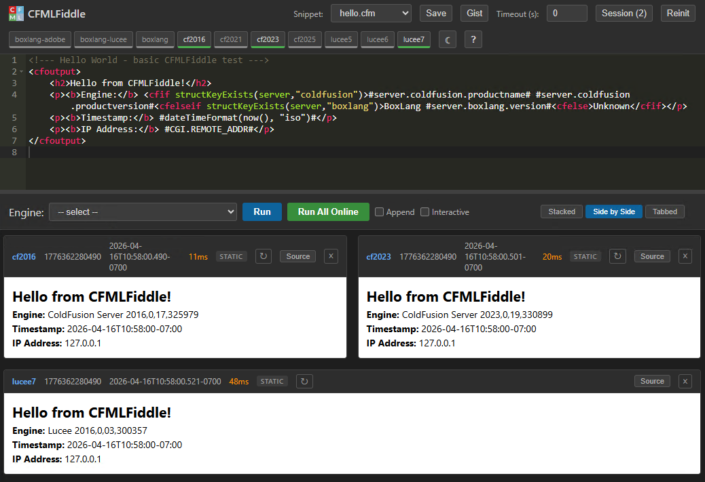

<p align="center">
  
</p>

<h1 align="center">cfmlFiddle</h1>

<p align="center">
  A self-hosted CFML playground that runs multiple engines side by side.<br>
  Powered by <a href="https://www.ortussolutions.com/products/commandbox">CommandBox</a>.
</p>

<p align="center">
  
</p>

---

## What is this?

cfmlFiddle lets you write CFML code and run it against Adobe ColdFusion, Lucee, and BoxLang at the same time. You pick which engine versions to install, down to the patch level, and you can compare output across all of them in one view.

It runs locally on your machine through CommandBox. No login, no restricted functions, works offline.

Online tools like [CFFiddle.org](https://cffiddle.org), [TryCF.com](https://trycf.com), and [Try BoxLang](https://try.boxlang.io/) are handy for quick browser tests. cfmlFiddle is for when you need to pin a specific version, test something that touches the filesystem, or figure out why Lucee and Adobe CF disagree on how `dateFormat` handles a weird edge case.

## Features

- Run code on one engine or all running engines at once
- Results displayed stacked, side by side, or tabbed
- Light and dark themes (follows your OS preference, or toggle manually)
- Interactive mode auto-detects forms and renders them in a sandboxed iframe so they can post back to themselves
- Save and load code snippets, or import directly from a GitHub Gist URL
- Session panel lists every payload you've run with timestamps - click any to reload it into the editor
- Archive All zips up old payloads and clears the session
- Per-result refresh (re-executes and updates timing) and dismiss buttons
- Server management with context menus for admin panels, docs, and project links
- Real-time status via Server-Sent Events (falls back to polling)
- Heartbeat checks all engines with TCP socket connections in ~50ms
- Keyboard accessible with focus indicators, skip link, and ARIA roles
- All frontend libraries ship locally - no CDN required

## Engines included

The default configuration ships with server configs for:

| Engine | Versions | Ports |
|--------|----------|-------|
| Adobe ColdFusion | 2016, 2021, 2023, 2025 | 12016, 12021, 12023, 12025 |
| Lucee | 5, 6, 7 | 13005, 13006, 13007 |
| BoxLang | latest (native, Adobe compat, Lucee compat) | 14000, 14001, 14002 |

Start whichever ones you need from the Server Management panel. Most of the time you'll only run two or three.

## Getting started

You need [CommandBox](https://www.ortussolutions.com/products/commandbox) installed.

1. Clone or download this repo.
2. Edit `config.json` in the project root. At minimum, set `boxExe` to the path of your `box` executable.
3. Run the launcher:
   ```
   box task run launchCFMLFiddle
   ```
   It shows a menu of available engines. Pick one to start as the primary host, and it opens in your browser.
4. Start additional engines from the Server Management panel (click the status bar in the top right).
5. Write code, pick an engine (or "Run All Online"), and hit Run.

### Other ways to start

Windows: double-click `startCFMLFiddle.bat`

Or start a specific engine directly:
```
box server start serverConfigFile=current-servers/server.cf2025.json
```

## How it works

cfmlFiddle is a single-page app. One CommandBox server hosts the UI (the editor, status bar, results panel). When you click Run, it writes your code to a temp file in `_payloads/`, then uses `cfhttp` to execute that file on the target engine(s) and returns the output.

Each engine is a separate CommandBox server sharing the same `www/` webroot. They all run the same `Application.cfc`, which handles IP allowlisting, payload token auth, and heartbeat monitoring.

The heartbeat uses a fast TCP socket check (~50ms for all engines) and can use either polling or Server-Sent Events (SSE) for real-time status updates.

### Interactive mode

If your code outputs a form, cfmlFiddle auto-detects it and renders the result in an iframe. Forms can post back to themselves, so you can build multi-step scripts that process their own input. You can also force interactive mode with the checkbox.

## Configuration

All settings live in `config.json` in the project root (above `www/`). The app reads it on startup; click Reinit in the UI to reload after changes.

| Setting | Default | What it does |
|---------|---------|--------------|
| `allowedIPs` | `127.0.0.1,::1,...` | Comma-separated IP allowlist. Use `*` for any. |
| `executionTimeout` | `0` | Seconds before a script is killed. 0 = no limit. Adjustable in the UI. |
| `serverPollInterval` | `30` | How often the server-side heartbeat runs (seconds). |
| `clientPollInterval` | `10` | How often the UI polls for updates (seconds). Ignored when SSE is active. |
| `editorTheme` | `monokai` | Ace Editor theme name. |
| `boxExe` | `box` | Full path to the CommandBox executable. |
| `useLocalAssets` | `true` | Load JS/CSS from local `assets/vendor/` instead of CDN. |
| `useSSE` | `false` | Use Server-Sent Events instead of polling. Faster updates, uses one persistent connection. |

### Server configs

Server configs live in `current-servers/`. Each `server.*.json` file defines a CommandBox server instance. Copy one to add a new engine.

Each config includes a `jvm.javaHome` path that points to the Java installation used by that engine. Different engines may require different Java versions (e.g. Adobe CF2016 needs Java 11, while BoxLang and CF2025 need Java 21+). If you have multiple JDKs installed, edit `javaHome` in each server config to match. If omitted, CommandBox uses whatever Java it was started with.

The `customTagPaths` and `app.libDirs` paths reference the `CustomTags/` and `JavaLibs/` directories in the project root. If you install cfmlFiddle somewhere other than the default location, update these paths in each server config.

## Project structure

```
cfmlfiddle/
  config.json              # app configuration
  launchCFMLFiddle.cfc     # CommandBox task runner (start menu)
  forgetServers.cfc        # CommandBox task runner (cleanup)
  current-servers/         # server.json templates per engine
  www/                     # webroot (shared by all engines)
    Application.cfc        # IP gate, heartbeat, payload auth
    index.cfm              # single-page UI
    api2/                  # JSON API endpoints
    assets/                # CSS, JS, vendor libs, icons
    _payloads/             # temp files (auto-managed)
  snippets/                # loadable code samples
  archive/                 # zipped old payloads
  CustomTags/              # shared custom tags (all engines)
  JavaLibs/                # shared Java JARs (all engines)
  JSONUtil/                # JSON serialization library
```

## Credits

Created by [myCFML.com](https://www.mycfml.com/)
Sponsored by [SunStar Media](https://www.sunstarmedia.com/)

### Libraries

| Library | License |
|---------|---------|
| [Ace Editor](https://ace.c9.io/) | BSD 3-Clause |
| [SweetAlert2](https://sweetalert2.github.io/) | MIT |
| [jQuery](https://jquery.com/) | MIT |
| [jQuery contextMenu](https://swisnl.github.io/jQuery-contextMenu/) | MIT |
| [JSONUtil](https://github.com/CFCommunity/jsonutil) | Apache 2.0 |
| [cf_dump](https://github.com/kwaschny/cf_dump) | MIT |

### Engines

| Engine | Website |
|--------|---------|
| [Adobe ColdFusion](https://coldfusion.adobe.com/) | coldfusion.adobe.com |
| [Lucee](https://www.lucee.org/) | lucee.org |
| [BoxLang](https://boxlang.io/) | boxlang.io |
| [CommandBox](https://www.ortussolutions.com/products/commandbox) | ortussolutions.com |

## License

MIT. See vendor subdirectories for third-party license files.
